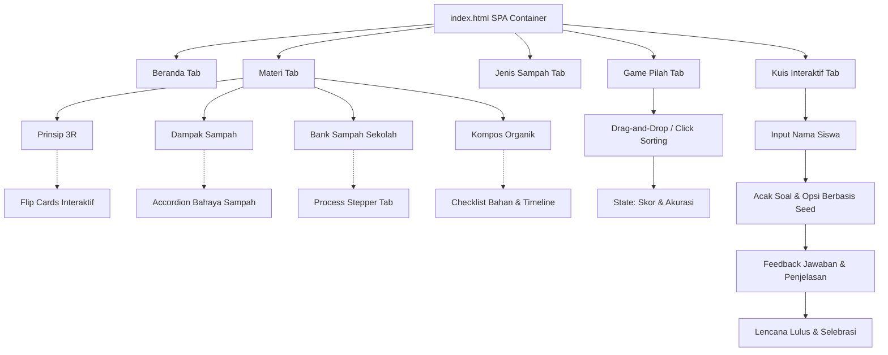

# EcoEdu - Aplikasi Edukasi Pengelolaan Sampah

**EcoEdu** adalah aplikasi web edukasi pengelolaan sampah interaktif berbasis Single Page Application (SPA) yang dikembangkan untuk siswa UPT SMP Negeri 4 Gadingrejo. Proyek ini bertujuan mendukung program Adiwiyata sekolah dengan memberikan pemahaman teori dan praktik tata kelola sampah secara menyenangkan melalui materi interaktif, game pemilahan sampah, dan kuis personal.

---

## 🗺️ Struktur Folder & File

Proyek ini memiliki struktur minimalis dan modular yang sepenuhnya dijalankan dari sisi klien (client-side):

```text
Latihan_website/
├── index.html   # Struktur utama halaman web (SPA & konten modal)
├── app.js       # Logika aplikasi (SPA, database materi, game, dan kuis)
├── style.css    # Desain visual, tata letak responsif, dan efek animasi
└── README.md    # Dokumentasi proyek (file ini)
```

---

## ⚡ Fitur Utama

1. **SPA (Single Page Application) Navigation:** Perpindahan antar-halaman yang cepat tanpa *reload* browser menggunakan manipulasi kelas DOM.
2. **Interactive Study Center (Pusat Belajar):**
   - **Prinsip 3R (Reduce, Reuse, Recycle):** Kartu bolak-balik (*flip cards*) yang menampilkan contoh aksi nyata.
   - **Dampak Lingkungan:** Akordeon interaktif mengenai bahaya sampah bagi alam dan kesehatan.
   - **Panduan Bank Sampah:** Penjelasan bertahap (*stepper*) tata cara menyetor sampah kering.
   - **Kompos Mandiri:** Daftar periksa (*checklist*) bahan komposer dan linimasa pembuatan kompos.
3. **Mengenal 4 Jenis Sampah:** Panduan visual klasifikasi tempat sampah standar nasional:
   - 🟢 **Hijau:** Organik (sampah basah/mudah membusuk).
   - 🟡 **Kuning:** Anorganik (plastik, kaleng, styrofoam).
   - 🔵 **Biru:** Kertas (buku bekas, kardus kering).
   - 🔴 **Merah:** B3 (baterai bekas, lampu neon rusak, racun nyamuk).
4. **Game Pilah Sampah (Gamifikasi):**
   - Mendukung **Drag-and-Drop** untuk desktop/laptop dan **Click-Fallback** untuk perangkat mobile.
   - Sistem penilaian: `+10` untuk benar, `-5` untuk salah.
   - Selebrasi kemenangan dengan efek konfeti (*canvas-confetti*).
5. **Kuis Interaktif dengan Sistem Seed (Acak Unik):**
   - Pengacakan soal dan opsi jawaban dibuat secara unik berbasiskan *seed* nama siswa, sehingga susunan soal berbeda untuk setiap murid.
   - Penilaian akhir otomatis yang menghasilkan lencana kelulusan:
     - 🏆 **Lencana Emas** (Skor $\ge 90\%$) - *Pahlawan Adiwiyata*
     - 🥈 **Lencana Perak** (Skor $70\% - 80\%$) - *Pencinta Lingkungan*
     - 🛡️ **Lencana Perunggu** (Skor $< 70\%$) - *Kadet Hijau*
6. **Dark & Light Mode:** Penggantian tema tampilan secara dinamis yang preferensinya disimpan di browser (`localStorage`).

---

## 📊 Alur Kerja Aplikasi

Berikut adalah diagram alur data dan interaksi pengguna di EcoEdu:



---

## 🛠️ Detail Teknis & Pustaka

* **Bahasa Dasar:** HTML5 (Semantik), CSS3 (Grid, Flexbox, Variable), dan JavaScript (ES6+).
* **Tipografi:** Google Fonts (Outfit).
* **Ikon:** FontAwesome (v6.4.0) via CDN.
* **Efek Selebrasi:** `canvas-confetti` (v1.6.0) via CDN.

---

## 💻 Cara Menjalankan

Aplikasi ini bersifat statis sehingga tidak memerlukan konfigurasi server web database yang rumit. 

1. **Jalankan via Localhost (Direkomendasikan):**
   Salin folder proyek ini ke direktori server lokal Anda (misal `C:\xampp\htdocs\`) lalu jalankan Apache server dan akses via browser:
   ```text
   http://localhost/tugas/Aplikasi-Edukasi-Sampah/Latihan_website/index.html
   ```
2. **Buka Langsung di Browser:**
   Klik kanan pada file `index.html` dan pilih **Open with** kemudian klik browser pilihan Anda (Google Chrome, Microsoft Edge, Firefox).
